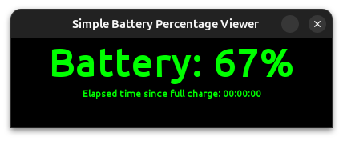

# Simple Battery Percentage Viewer (sbpv)

Snap Java application that shows the battery percentage. This project was born with the aim to try to create a snap
starting from a Swing Java application.

# Technologies and Tools

- Java 11 (SWING, Process)
- snapcraft

# Screenshot



# Build snap file

From the project root directory execute the following statements:

```bash
# remove old snap file
sudo rm sbpv_2.0.0_amd64.snap;
# clean and regenerate snap file 
sudo snapcraft clean --use-lxd --verbose && sudo snapcraft --use-lxd --debug --verbose; 
# unistall snap file
sudo snap remove sbpv;
# install the new generated snap file 
sudo snap install sbpv_2.0.0_amd64.snap --dangerous --devmode && sbpv;
```